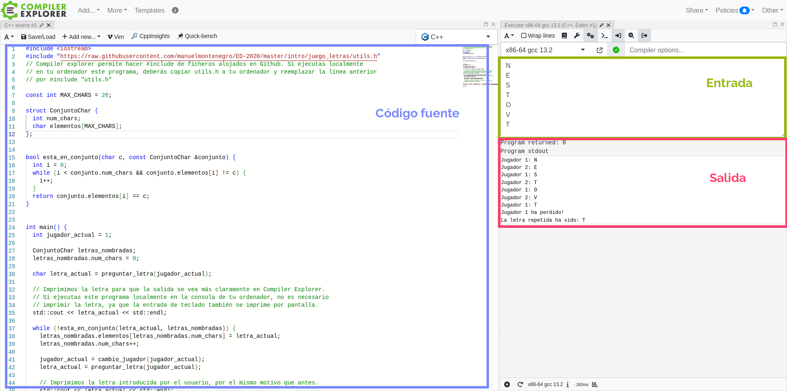

# Cómo usar compiler explorer

La pantalla de Compiler Explorer se divide en tres zonas:

* **Código fuente**: Aquí se escribe el código C++ del programa que quieres ejecutar. Cada vez que lo modificas, se compila automáticamente.
    
* **Entrada**: La información que recibirá el programa a través de la salida estándar. Cada vez que tu programa ejecute `cin >> ...`, la lectura se realizará a partir de lo que haya en el cuadro de texto.

* **Salida**: Salida estándar escrita por tu programa mediante `cout << ...`. Si hubiera errores de compilación en tu código, se mostrarían aquí. Aquí también aparece una línea con el texto `Program returned: N`, donde `N` es un número. Si `N` es 0, el programa ha finalizado correctamente. Si es un número distinto de 0, es que tu programa ha producido un error en tiempo de ejecución (división por cero, acceso a puntero inválido, acceso a un array más allá de sus límites, etc). 

## ¿Y si no me aparece el panel de Entrada y Salida?

Encima del código fuente, haz clic en el menú *Add new...* y selecciona *Execution Only*.